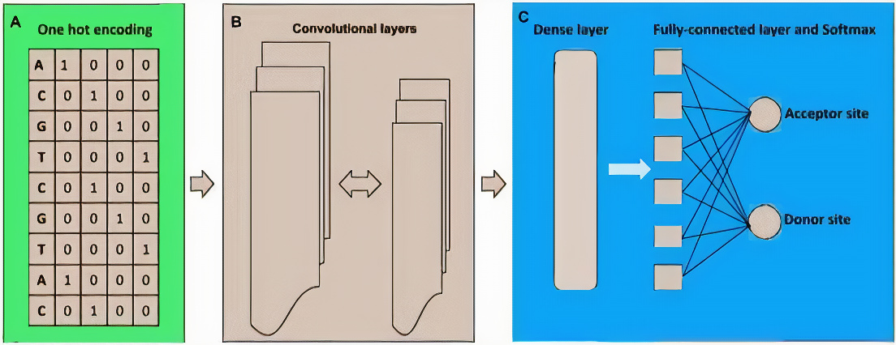
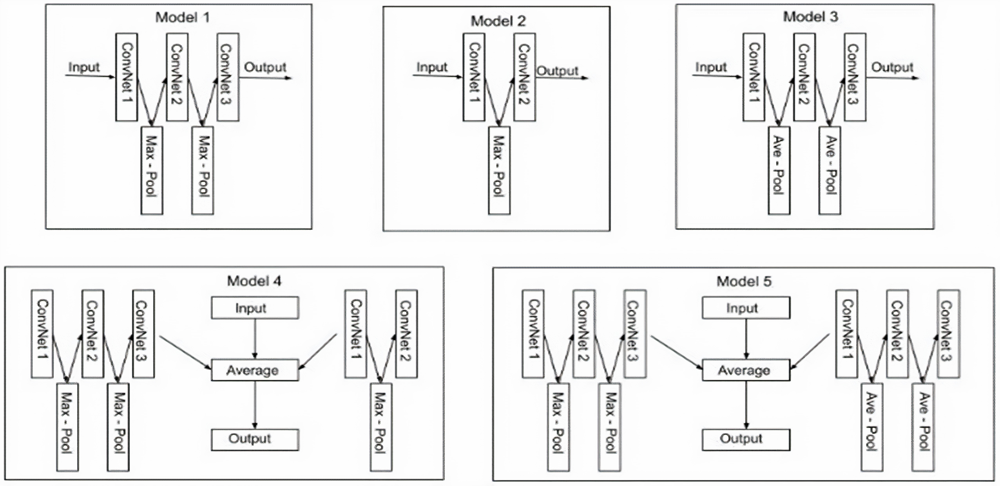
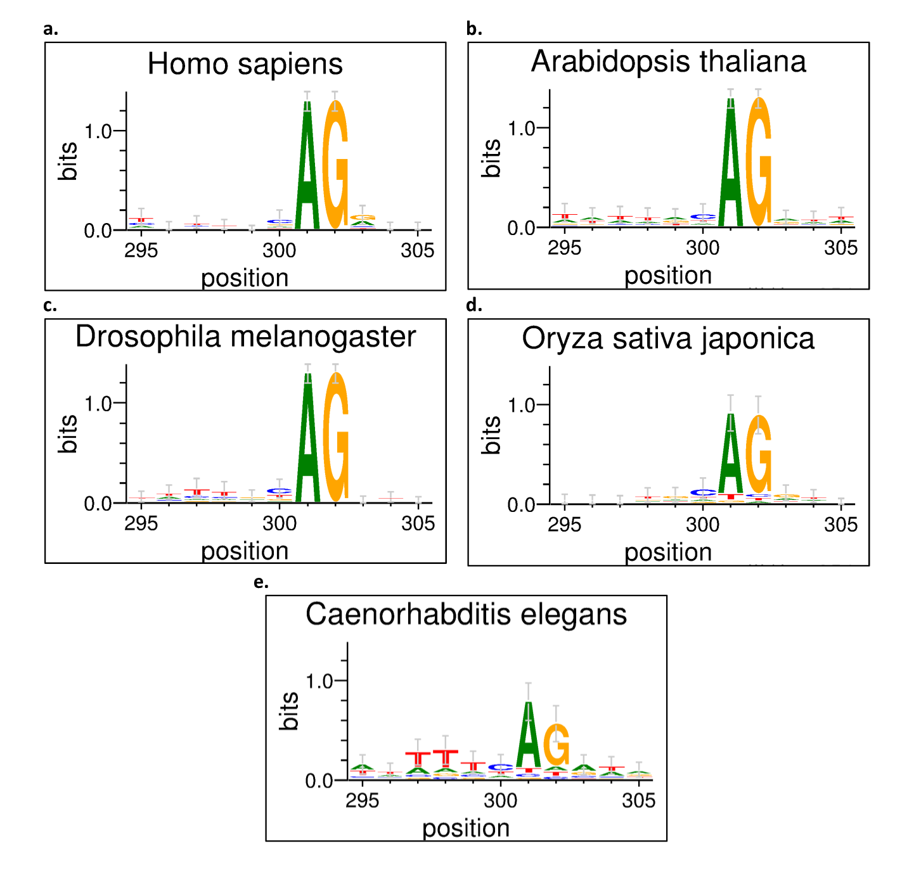
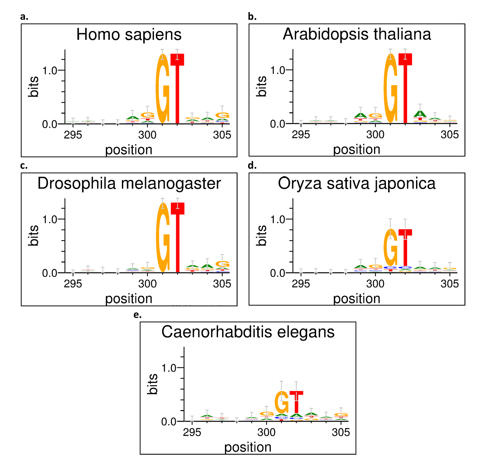

# CNNSplice
**CNNSplice: Robust Models for Splice Site Prediction Using Deep Convolutional Neural Networks**

**OluwadareLab,**
**University of Colorado, Colorado Springs**

----------------------------------------------------------------------
**Developers:**  
		 &nbsp;&nbsp;&nbsp;&nbsp;&nbsp;&nbsp;&nbsp;&nbsp;&nbsp;&nbsp;&nbsp;&nbsp;&nbsp;&nbsp;Victor Akpokiro 
		 &nbsp;&nbsp;&nbsp;&nbsp;&nbsp;&nbsp;&nbsp;&nbsp;&nbsp;&nbsp;&nbsp;&nbsp;&nbsp;&nbsp;Department of Computer Science  
		 &nbsp;&nbsp;&nbsp;&nbsp;&nbsp;&nbsp;&nbsp;&nbsp;&nbsp;&nbsp;&nbsp;&nbsp;&nbsp;&nbsp;University of Colorado, Colorado Springs  
		 &nbsp;&nbsp;&nbsp;&nbsp;&nbsp;&nbsp;&nbsp;&nbsp;&nbsp;&nbsp;&nbsp;&nbsp;&nbsp;&nbsp;Email: vakpokir@uccs.edu   

**Contact:**  
		 &nbsp;&nbsp;&nbsp;&nbsp;&nbsp;&nbsp;&nbsp;&nbsp;&nbsp;&nbsp;&nbsp;&nbsp;&nbsp;&nbsp;Oluwatosin Oluwadare, PhD  
		 &nbsp;&nbsp;&nbsp;&nbsp;&nbsp;&nbsp;&nbsp;&nbsp;&nbsp;&nbsp;&nbsp;&nbsp;&nbsp;&nbsp;Department of Computer Science  
		 &nbsp;&nbsp;&nbsp;&nbsp;&nbsp;&nbsp;&nbsp;&nbsp;&nbsp;&nbsp;&nbsp;&nbsp;&nbsp;&nbsp;University of Colorado, Colorado Springs  
		 &nbsp;&nbsp;&nbsp;&nbsp;&nbsp;&nbsp;&nbsp;&nbsp;&nbsp;&nbsp;&nbsp;&nbsp;&nbsp;&nbsp;Email: ooluwada@uccs.edu 
    
--------------------------------------------------------------------	

**1.	Build Instruction:**
-----------------------------------------------------------	

CNNSplice can be run in a Docker-containerized environment locally on users computer. Before cloning this repository and attempting to build, the [Docker engine](https://docs.docker.com/engine/install/), If you are new to docker [here is a quick docker tutorial for beginners](https://docker-curriculum.com/).   
To install and build TADMaster follow these steps.

1. Clone this repository locally using the command `git clone https://github.com/OluwadareLab/CNNSplice.git`.
2. Pull the TADMaster docker image from docker hub using the command `docker pull oluwadarelab/cnnsplice:latest`. This may take a few minutes. Once finished, check that the image was sucessfully pulled using `docker image ls`.
3. Run the CNNSplice container and mount the present working directory to the container using `docker run -v ${PWD}:${PWD}  -p 8050:8050 -it oluwadarelab/CNNSplice`.
4. `cd` to your file directory.

Exciting! You can now access CNNSplice locally.

**2.	Dependencies:**
-----------------------------------------------------------
Our constructed dataset permits a 
**Sequence Length of 400**

**3.	One-Hot encoding and Hyper-parameter tuning:**
-----------------------------------------------------------

We mapped genomic nucleotide bases to a collection of binary integer variables in this experiment. Adenine (A) is represented by [1 0 0], Cytosine (C) is represented by [0 1 0 0], Guanine (G) is represented by [0 0 1 0], and Thymine (T) is represented by [0 0 0 1], with 1 denoting the location of each nucleotide in the vector set. As a result, we feed the CNN architecture a N X 4 input matrix, with N denoting the length of the genomic sequence and 4 denoting the nucleotides (A, C, G, T).
We tuned the hyperparameters during learning based on the ranges shown in Table below search space, with the best performing hyperparameters chosen for the model generation. The figure below shows the architectural pipeline summary.

**4.	Cross Validation:**
-----------------------------------------------------------

CNNSplice splits the training dataset into 5-folds using k-fold cross-validation with the StratifiedKFold Machine Learning module. We reconstructed the cross-validation datasets from the source datasets [Albaradei, S. et al]*(https://pubmed.ncbi.nlm.nih.gov/32550561/)*; 75% of this dataset’s distribution was used as a training set for the 5-fold cross-validation and 25% was used as the test dataset, which was untouched during the training phase. The supplementary file in the Log file folder contains the result of the cross-validation experiments. The result of the cross-validation is a set of models for which the figure below shows the deep learning layer architecture.

**5.	Robustness Test:**
-----------------------------------------------------------

For both the acceptor and donor organism datasets, we randomly picked 100 sequences of each organism. Sequence positions 295 to 305 are represented by the magnitude of the genomic sequence characters in the motif. As seen in the figures below, the AG contributes significantly and positively to the acceptor site, while the GT contributes significantly and positively to the donor site. For each of the organism datasets, this can be seen.

 

**6.	Usage:**
----------------------------------------------------------- 
Usage: To use, type in the terminal python cnnsplice.py -n model_name -s sequence(acceptor or donor) -o organism_name -e encoded_sequnce_file -l encoded_label_file   	
                          		
                              
* **Arguments**:  	
	* model_name: A string for the name of the model  
	* mode: A string to specify balanaced or imbalanced input dataset 
	* organism: A optional argument string to specify organism name i.e ["hs", "at", "oriza", "d_mel", "c_elegans"]  
	* encoded sequence file: A optional argument file containing the encoded sequence data  
	* encoded label file: A optional argument file containing the encoded label data  

**7.	Output:**
-----------------------------------------------------------
Deepsplicer outputs three files: 

1. .h5: The deepslicer model and weight file.
2. .txt: A log file that contains the accuracy and evaluation metrics results.
3. png: contains the plotting of the prediction accuracy

**8.	Note:**
-----------------------------------------------------------
* Dataset sequence length is 400.
* Genomic sequence input data should be transfomed using one-hot encoding.

