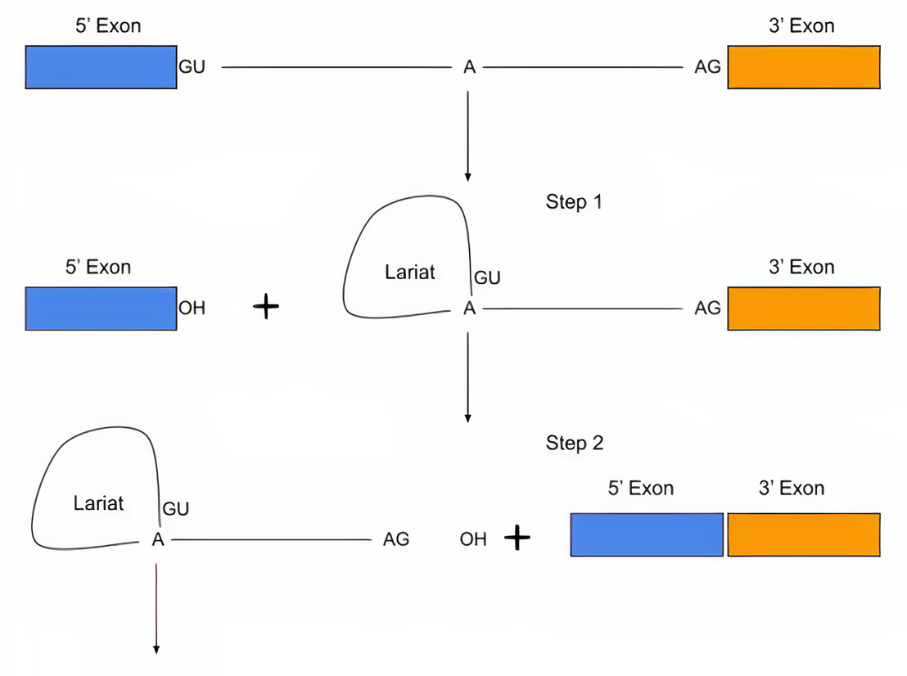

# CNNSplice
**CNNSplice: Robust Models for Splice Site Prediction Using Deep Convolutional Neural Networks**

**OluwadareLab,**
**University of Colorado, Colorado Springs**

----------------------------------------------------------------------
**Developers:**  
		 &nbsp;&nbsp;&nbsp;&nbsp;&nbsp;&nbsp;&nbsp;&nbsp;&nbsp;&nbsp;&nbsp;&nbsp;&nbsp;&nbsp;Victor Akpokiro 
		 &nbsp;&nbsp;&nbsp;&nbsp;&nbsp;&nbsp;&nbsp;&nbsp;&nbsp;&nbsp;&nbsp;&nbsp;&nbsp;&nbsp;Department of Computer Science  
		 &nbsp;&nbsp;&nbsp;&nbsp;&nbsp;&nbsp;&nbsp;&nbsp;&nbsp;&nbsp;&nbsp;&nbsp;&nbsp;&nbsp;University of Colorado, Colorado Springs  
		 &nbsp;&nbsp;&nbsp;&nbsp;&nbsp;&nbsp;&nbsp;&nbsp;&nbsp;&nbsp;&nbsp;&nbsp;&nbsp;&nbsp;Email: vakpokir@uccs.edu   

**Contact:**  
		 &nbsp;&nbsp;&nbsp;&nbsp;&nbsp;&nbsp;&nbsp;&nbsp;&nbsp;&nbsp;&nbsp;&nbsp;&nbsp;&nbsp;Oluwatosin Oluwadare, PhD  
		 &nbsp;&nbsp;&nbsp;&nbsp;&nbsp;&nbsp;&nbsp;&nbsp;&nbsp;&nbsp;&nbsp;&nbsp;&nbsp;&nbsp;Department of Computer Science  
		 &nbsp;&nbsp;&nbsp;&nbsp;&nbsp;&nbsp;&nbsp;&nbsp;&nbsp;&nbsp;&nbsp;&nbsp;&nbsp;&nbsp;University of Colorado, Colorado Springs  
		 &nbsp;&nbsp;&nbsp;&nbsp;&nbsp;&nbsp;&nbsp;&nbsp;&nbsp;&nbsp;&nbsp;&nbsp;&nbsp;&nbsp;Email: ooluwada@uccs.edu 
    
--------------------------------------------------------------------	

**1.	Introduction:**
-----------------------------------------------------------	

Post-transcriptional splicing of ribonucleic acid (mRNA) required for gene annotation, comprises eliminating regions of RNA sequences (Introns) that do not carry the necessary information for gene expression. Splice sites (SS) are regions or boundaries of an RNA sequence located in the 5′ and 3′ directions of the Introns. The spliceosome enzyme eliminates these portions as they do not contain information essential for gene expression. 
 

 
In this research work, we trained and tested a range of deep learning models, based on deep Convolutional Neural Networks (CNNs), for splice prediction using a 5-fold cross-validation test; and we chose the most consistent and high-performing models across different organisms for splice site prediction in balanced and imbalanced datasets. Thus, we call these robust Deep learning models CNNSplice.
  
**Page folder content**
* *src*: CNNSplice source code. cnnsplice.py  
* *src*: CNNSplice cross-validation source code. cnnsplice_cross_val.py 
* *src*: CNNSplice validation source code. cnnsplice_val.py  
* Models file for CNNSplice models  
* Log file for Results logs and tables  
* Plots file for Results plots and figures  

**2.	Datasets:**
-----------------------------------------------------------
We constructed a balanced and unbalanced dataset from five carefully selected datasets from organisms namely: *Homo sapiens*, *Oryza sativa japonica*, *Arabidopsis thaliana*, *Drosophila melanogaster*, and *Caenorhabditis elegans*. We downloaded these reference genomic sequence data from [Albaradei, S. et al]*(https://pubmed.ncbi.nlm.nih.gov/32550561/)*. Our algorithms result in independent acceptor and donor models from each downloaded dataset trained. In order to have a comprehensive training dataset, we trained CNNSplice on a total of 10000 sequences with the balanced and imbalanced distribution involving ratio 1:1 and 3:1 respectively. Our constructed dataset permits a 
**Sequence Length of 400**

**3.	One-Hot encoding and Hyper-parameter tuning:**
-----------------------------------------------------------

We mapped genomic nucleotide bases to a collection of binary integer variables in this experiment. Adenine (A) is represented by [1 0 0], Cytosine (C) is represented by [0 1 0 0], Guanine (G) is represented by [0 0 1 0], and Thymine (T) is represented by [0 0 0 1], with 1 denoting the location of each nucleotide in the vector set. As a result, we feed the CNN architecture a N X 4 input matrix, with N denoting the length of the genomic sequence and 4 denoting the nucleotides (A, C, G, T).
We tuned the hyperparameters during learning based on the ranges shown in Table below search space, with the best performing hyperparameters chosen for the model generation. The figure below shows the architectural pipeline summary.

**4.	Cross Validation:**
-----------------------------------------------------------

CNNSplice splits the training dataset into 5-folds using k-fold cross-validation with the StratifiedKFold Machine Learning module. We reconstructed the cross-validation datasets from the source datasets [Albaradei, S. et al]*(https://pubmed.ncbi.nlm.nih.gov/32550561/)*; 75% of this dataset’s distribution was used as a training set for the 5-fold cross-validation and 25% was used as the test dataset, which was untouched during the training phase. The Log file folder contains the result of the cross-validation experiments. The result of the cross-validation is a set of models for which the figure below shows the deep learning layer architecture.

**5.	Robustness Test:**
-----------------------------------------------------------

For both the acceptor and donor organism datasets, we randomly picked 100 sequences of each organism. Sequence positions 295 to 305 are represented by the magnitude of the genomic sequence characters in the motif. As seen in the figures below, the AG contributes significantly and positively to the acceptor site, while the GT contributes significantly and positively to the donor site. For each of the organism datasets, this can be seen.

 

**6.	Usage:**
----------------------------------------------------------- 
Usage: To use, type in the terminal python cnnsplice.py -n model_name -s sequence(acceptor or donor) -o organism_name -e encoded_sequnce_file -l encoded_label_file   	
                          		
                              
* **Arguments**:  	
	* model_name: A string for the name of the model  
	* sequence: A string to specify acceptor or donor input dataset 
	* organism: A string to specify organism name i.e ["hs", "at", "oriza", "d_mel", "c_elegans"]  
	* encoded sequence file: A file containing the encoded sequence data  
	* encoded label file: A file containing the encoded label data  

**7.	Output:**
-----------------------------------------------------------
Deepsplicer outputs three files: 

1. .h5: The deepslicer model and weight file.
2. .txt: A log file that contains the accuracy and evaluation metrics results.
3. png: contains the plotting of the prediction accuracy

**8.	Note:**
-----------------------------------------------------------
* Dataset sequence length is 400.
* CNNSplice folders [log, models, plots] is essential for code functionality.
* Genomic sequence input data should should transfomed using one-hot encoding.

